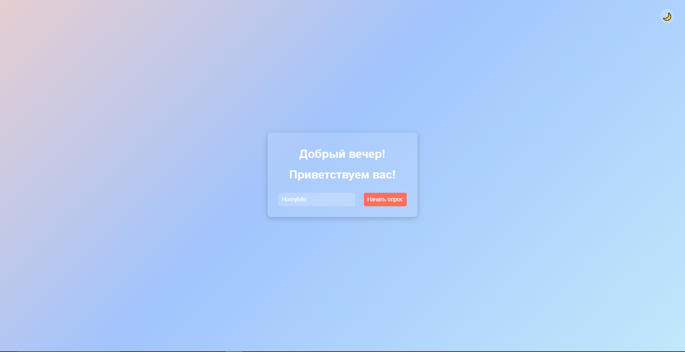
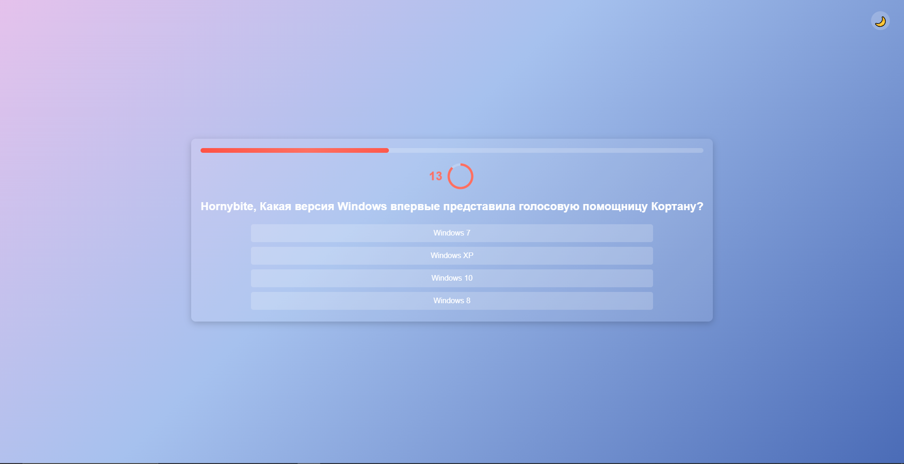
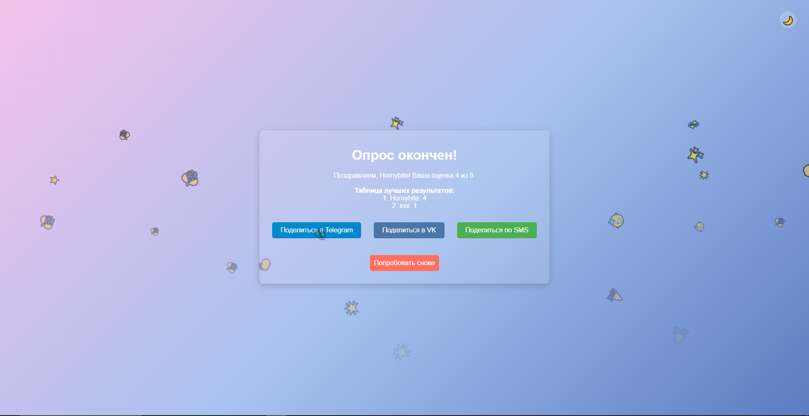

# IT project, by Petrov Dmitry aka Hornybite. School №56, 9V form.
---
## About quiz-website
> I have to mention, I am not professional at making websites. Warning: huge amount of trashcode.
Quiz I made is an interactive way to test your knowledge about operating systems and the history of Linux! This app is designed to provide an engaging quiz experience with features like a timer, progress bar, sound effects, and even confetti animations when you finish the quiz.
## Features
- User-Friendly Interface:

  - Start by entering your name to personalize the quiz experience.

  - Clean and intuitive design with smooth transitions between pages.

- Dynamic Greeting:

  - The app greets you based on the time of day (morning, afternoon, evening, or night) in the UTC+5 timezone.

- Interactive Quiz:

  - Multiple-choice questions with randomized options for each attempt.

  - A timer for each question to keep the quiz challenging.

  - Progress bar to track your advancement through the quiz.

- Sound Effects:

  - Play sound effects for button clicks, correct answers, and wrong answers to enhance the experience.

- Confetti Animation:

  - Celebrate your quiz completion with a fun confetti animation featuring emojis like 🎉, 🎊, and 🌟.

- Theme Switcher:

  - Toggle between light and dark themes for a personalized visual experience.

- Share Your Results:

  - Share your quiz results on Telegram, VKontakte, or via SMS directly from the app.

- High Score Tracking:

  - Save your scores locally and view the leaderboard to see how you stack up against others.

- Responsive Design:

  - Fully optimized for mobile devices, ensuring a seamless experience on any screen size.

---

## Technologies Used
1. HTML5: Structure of the app.

2. CSS3: Styling, animations, and responsive design.

3. JavaScript: Logic, interactivity, and dynamic content.

4. LocalStorage: Save and retrieve high scores.

5. Canvas Confetti: Emoji-based confetti animation.

6. Web Audio API: Play sound effects.

---

## Installation

1. Clone the repository or download the source code.
2. Open the `index.html` file in your browser.
3. Start the quiz and enjoy!

---

## Customization

- **Questions**: Modify the `questions` array in `script.js` to add or change quiz questions.
- **Sounds**: Replace the audio files (`button-click.mp3`, `correct-answer.mp3`, `wrong-answer.mp3`) to customize sound effects.
- **Styling**: Adjust the CSS in `styles.css` to change colors, fonts, or animations.

---

## Credits

- **Emoji Confetti**: Custom implementation using HTML, CSS, and JavaScript.
- **Canvas Confetti Library**: Used for additional confetti effects.
- **Sound Effects**: Free-to-use sound effects from public domains.

---

## License

This project is open-source and available under the MIT License. Feel free to use, modify, and distribute it as needed.

---

## Screenshots

*Start Page with Name Input*

*Quiz Page with Timer and Progress Bar*

*End Page with Score and Share Options*

---

Enjoy the quiz and happy learning! 🚀
